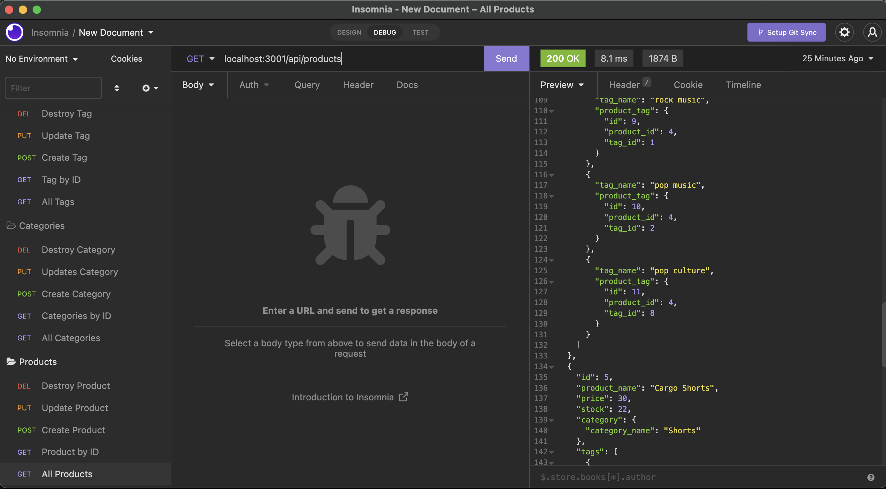

# E-commerce

 ## Description
  This application creates an e-commerce back end for an internet retail company's website.  There is are seeds with test data so you are able to see how different API routes work.  You can GET from the categories, products, or tags as well as POST, PUT, and DELETE.

  ## Installation
  To install required dependecies, use: npm install 

  ## Usage
  To run the app, you need to log into mysql, and source db/schema.sql.  Then quit to return back to your command line.  Run npm run seed to seed the examples, and then npm start to start the application.  Use a program like Insomnia or Postman to test your routes using http://localhost:3001/api/___.   

  
  
  <a href="https://drive.google.com/file/d/15FGJm1cbebhtEXRqaTf_wuaV7OmfjJ5I/view">Here is a video demo.</a>

 ## Built With
 This application is built with:  
 * Express.js
 * Sequelize
 * MySQL2
 * dotenv

  ## Questions
  If you have any questions, please reach out on <a href="https://github.com/sacylkowski/">GitHub</a> or you can <a href="mailto:sacylkowski@gmail.com">E-mail me</a>.

